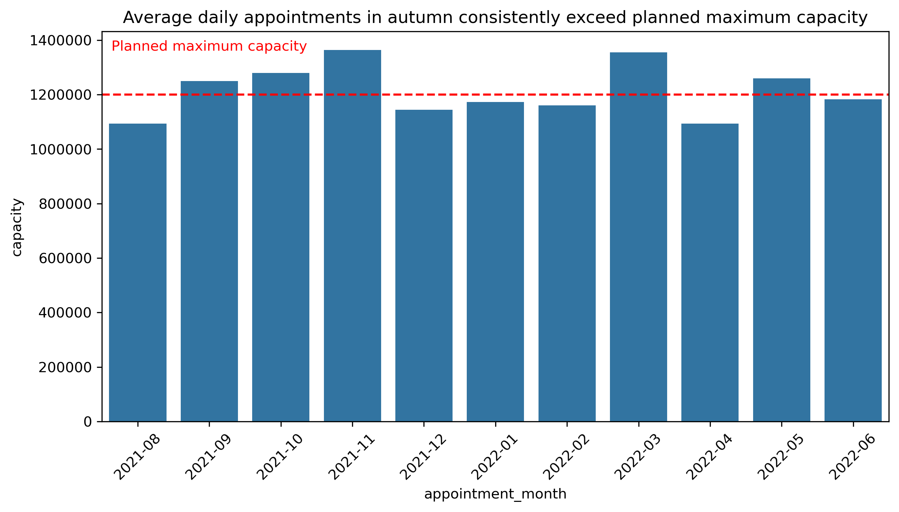
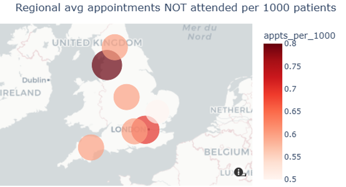
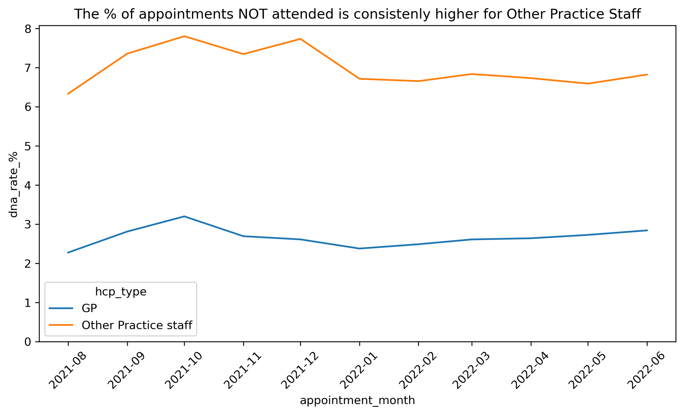

# operational-analytics-capacity-planning
Operational analytics project analysing demand, utilisation and attendance patterns to identify capacity constraints and efficiency opportunities. Using Python and data visualisation to support resource planning, service performance improvements and data-driven operational decision-making.

# Using Operational Analytics to Improve Capacity Planning, Resource Allocation and Service Performance

## Overview
This project explores how operational analytics can be used to improve resource allocation, identify capacity constraints and support service delivery. Using healthcare demand and utilisation data, I analysed patterns in service usage, attendance behaviour and regional variation to uncover opportunities for operational improvement.

## Business Problem
Increasing demand places pressure on organisations to deliver services efficiently while making the best use of available resources. Understanding when demand exceeds capacity, where utilisation varies, and what factors influence attendance is critical for effective planning and decision-making.

The objective of this project was to identify capacity pressures, utilisation trends and operational inefficiencies, and translate findings into actionable recommendations.

## Approach
- Cleaned and prepared multiple healthcare datasets using Python
- Conducted exploratory data analysis (EDA)
- Analysed demand patterns across time, geography and appointment type
- Investigated attendance behaviour and missed appointment rates
- Merged and transformed datasets to enable meaningful comparisons
- Developed stakeholder-focused visualisations to communicate findings

## Key Insights
- Demand regularly exceeded planned capacity during predictable periods of the year
- Significant regional variation existed in service utilisation
- Missed appointment rates varied by staff group and booking behaviour
- Appointments booked further in advance were associated with higher non-attendance rates
- Attendance patterns highlighted opportunities to improve operational efficiency

## Recommendations
- Staffing uplift of 8.5% for GP and Other Practice during Autumn and Spring months, prioritising the Southwest and Northeast and Yorkshire regions where utilisation is highest. 
- Introduce a targeted reminder system for Other Practice staff appointments made more than 2-days in advance, beginning with Northwest and London regions where DNA rates are highest.

## Tools Used
Python, Operational Analytics, Exploratory Data Analysis (EDA), Data Cleaning, Data Wrangling, Data Visualisation, Capacity Planning, Resource Allocation, Demand Analysis, Geographic Analysis, Service Performance Analysis, Business Intelligence

## Key Visuals
### Capacity Pressure Analysis
[

### Regional Utilisation Analysis
[

### Attendance Behaviour Analysis
[

## What I'd Do Next
This analysis identified relationships between non-attendance rates, booking timing and staff groups, but did not explain why these patterns exist. As a next step, I would investigate the drivers of missed appointments in more detail, including regional differences in attendance behaviour. This may involve collecting additional information through surveys or targeted outreach to better understand patient motivations and support more effective interventions to reduce non-attendance.
